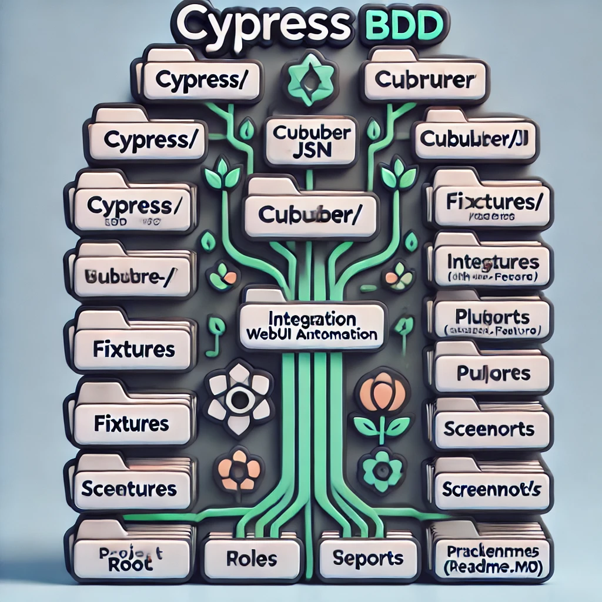

## Web UI Automation Framework

This automation framework is designed for end-to-end testing of web applications. It supports automated tests for various scenarios, including user interface and API tests, and provides a robust structure for scalable and maintainable test scripts.

### Tools Stack
1. **JDK**
2. **NodeJS**
3. **VS Code**
4. **Cypress**
5. **Mocha**
6. **Multiple Cucumber HTML Reporter**
7. **BDD**
8. **Cucumber**

### Scripting Language
JavaScript

### Framework Overview

1. **Cypress** is a Node.js program. To run Cypress, you need to have Node.js installed. Download Cypress via npm, which comes with Node.js.
2. You can verify your Node.js version by running `node --version`.
3. Cypress uses the Mocha test framework by default. This setup uses Mocha for its test interface along with BDD (Behavior-Driven Development) principles using Cucumber.

### Installation Steps

#### Step 1: Install Node.js
- Download and install Node.js from the official website.

#### Step 2: Install Visual Studio Code
- Download and install VS Code from the official website.

#### Step 3: Create a Project Directory
- Create a folder in any location for your project.

#### Step 4: Initialize npm
- Open the command prompt and navigate to the project folder.
- Run `npm init` to create a `package.json` file.

#### Step 5: Install Required Packages
- Use the following command to install Cypress and other dependencies:

npm install cypress mocha cucumber-html-reporter cypress-cucumber-preprocessor

## Here is the project folder structure formatted with proper new lines:

project-folder/
├── cypress/
│   ├── cucumber-json/
│   ├── fixtures/
│   ├── integration/
│   │   └── *.feature
│   ├── plugins/
│   │   └── index.js
│   ├── reports/
│   ├── screenshots/
│   ├── support/
│   └── videos/
├── node_modules/
├── cypress.config.js
├── package.json
└── README.md

### Running the Tests

To run all tests:

npm run test

To run tests in browser mode:

npm run sanityTest

npm run sanityTest